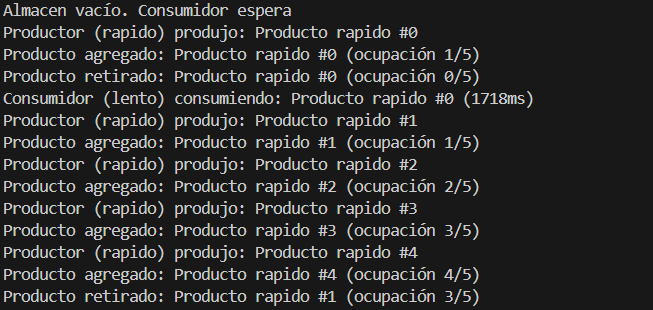

# Experimento Dos

Se cambian los parametros de tiempo de produccion por unos mas cortos a comparacion de los tiempos del consumo del cliente

**Explicación:**
Aquí lo que está ocurriendo es que el productor trabaja mucho más rápido que el consumidor, así que el almacén se llena mientras el consumidor sigue ocupado con un producto anterior. Cuando el consumidor termina, retira el siguiente producto disponible, pero mientras tanto el productor ya ha añadido varios más. El resultado es que el almacén nunca se queda vacío durante mucho tiempo y el ritmo lento del consumidor se convierte en el cuello de botella del sistema.

[Volver al README principal](../../README.md)
