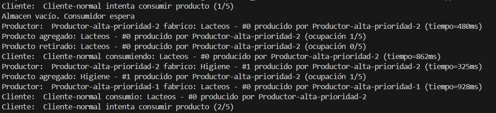

# Experimento Tres

Se establecen las prioridades mas altas en los hilos de productores

**Explicación:**

Al establecer una prioridad más alta para los productores, estos reciben más tiempo de ejecución del sistema operativo que el consumidor, lo que hace que generen productos más rápido de lo que el consumidor puede retirar y procesar. Como resultado, el almacén se llena con frecuencia y el consumidor se convierte en el cuello de botella, de manera similar a lo que ocurre cuando se acortan los tiempos de producción. La diferencia es que aquí no se modifica el ritmo de fabricación, sino que se influye en la planificación de los hilos para favorecer a los productores.

[Volver al README principal](../../README.md)
