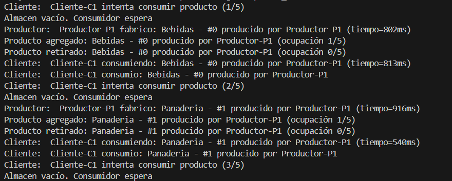

Experimento Uno

Se crea un unico Productos y un consumidor, y el productor producira 5 productos y el consumidor los consumira todos

Explicacion:

El cliente intenta consumir un producto, pero como el almacen esta vacio, se queda esperando. Cuando el productor termina de fabricar un producto, lo coloca en el almacen y esto despierta al cliente, que entonces lo retira y lo consume. Despues de consumirlo, vuelve a intentar obtener otro, pero como el almacen vuelve a estar vacio hasta que el productor genere el siguiente, el ciclo se repite.

[Volver al README principal](../../README.md)
